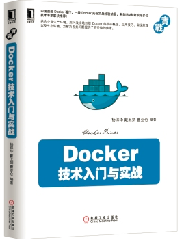

# Docker — 從入門到實踐

0.8.1

[Docker](http://www.docker.com) 是個跨時代的開源項目，它徹底釋放了計算虛擬化的威力，極大提高了應用的執行效率，降低了雲端計算資源供應的成本！ 使用 Docker，可以讓應用的部署、測試和分發都變得前所未有的高效和輕鬆！

無論是應用開發者、維運人員、還是其他資訊技術從業人員，都有必要認識和掌握 Docker，以在有限的時間內做更多有意義的事。

本開源書籍既適用於具備基礎 Linux 知識的 Docker 初學者，也希望可供理解原理和實作的進階使用者參考。同時，書中給出的實踐案例，可供在進行實際部署時借鑒。前六章為基礎內容，供使用者理解 Docker 的基本概念和作業；7 ~ 9 章介紹一些進階作業；第 10 章給出典型的應用場景和實踐案例；11、12 章介紹關於 Docker 安全和實作技術等進階話題。後續章節則分別介紹一些相關的熱門開源項目。

線上閱讀：[GitBook](https://wild0522.gitbooks.io/yeasy_dp) 或 [Github](https://github.com/yeasy/docker_practice/blob/master/SUMMARY.md)。

* pdf 版本 [下載](https://www.gitbook.com/download/pdf/book/wild0522/yeasy_dp)
* epub 版本 [下載](https://www.gitbook.com/download/epub/book/wild0522/yeasy_dp)

Docker 自身仍在快速發展中，生態環境也在蓬勃成長。歡迎參與維護項目：[如何貢獻](contribute.md)。

* [修訂記錄](revision.md)
* [貢獻者名單](https://github.com/yeasy/docker_practice/graphs/contributors)

## 技術交流
歡迎關注 DockerPool 社區微博 [@dockerpool](http://weibo.com/u/5345404432)，或加入 Docker 技術交流 QQ 群或微信組，分享 Docker 資源，交流 Docker 技術。

* QQ 群 I   （已滿）：341410255
* QQ 群 II  （已滿）：419042067
* QQ 群 III （已滿）：210028779
* QQ 群 IV  （已滿）：483702734
* QQ 群 V   （已滿）：460598761
* QQ 群 VI  （已滿）：581983671
* QQ 群 VII （已滿）：252403484
* QQ 群 VIII（已滿）：544818750
* QQ 群 IX  （已滿）：571502246
* QQ 群 X   （可加）：366203473

## 進階學習

《[Docker 技術入門與實戰](http://item.jd.com/11598400.html)》一書已經正式出版，包含大量第一手實戰案例和更為深入的技術剖析，歡迎大家閱讀使用並回饋建議。

* [China-Pub](http://product.china-pub.com/3770833)
* [京東圖書](http://item.jd.com/11598400.html)
* [當當圖書](http://product.dangdang.com/23620853.html)
* [亞馬遜圖書](http://www.amazon.cn/%E5%9B%BE%E4%B9%A6/dp/B00R5MYI7C/ref=lh_ni_t?ie=UTF8&psc=1&smid=A1AJ19PSB66TGU)

## 鼓勵項目

歡迎鼓勵項目一杯 coffee~

