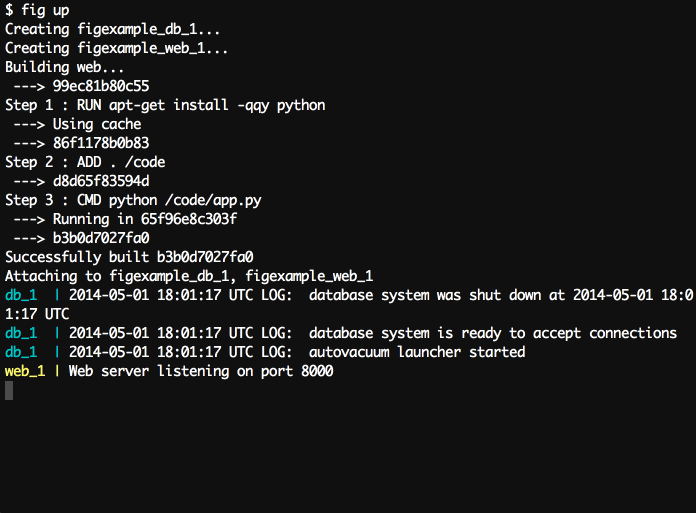

##快速搭建基於 Docker 的隔離開發環境

使用 `Dockerfile` 檔案指定你的應用環境，讓它能在任意地方複製使用：

```
FROM python:2.7
ADD . /code
WORKDIR /code
RUN pip install -r requirements.txt
```

在 `fig.yml` 檔案中指定應用使用的不同服務，讓它們能夠在一個獨立的環境中一起執行：

```
web:
  build: .
  command: python app.py
  links:
   - db
  ports:
   - "8000:8000"
db:
  image: postgres
```
**注意不需要再額外安裝 Postgres 了！*

接著執行指令 `fig up` ，然後 Fig 就會啟動並執行你的應用了。



Fig 可用的指令有:

* 啟動、停止，和重建服務
*  檢視服務的執行狀態
*  檢視執行中的服務的輸入日誌
* 對服務傳送指令

##快速上手
我們試著讓一個基本的 Python web 應用執行在 Fig 上。這個實驗假設你已經知道一些 Python 知識，如果你不熟悉，但清楚概念上的東西也是沒有問題的。

首先，[安裝 Docker 和 Fig](install.md)

為你的項目建立一個目錄

```
$ mkdir figtest
$ cd figtest
```
進入目錄，建立 `app.py`，這是一個能夠讓 Redis 上的一個值自增的簡單 web 應用，基於 Flask 框架。

```
from flask import Flask
from redis import Redis
import os
app = Flask(__name__)
redis = Redis(host='redis', port=6379)

@app.route('/')
def hello():
    redis.incr('hits')
    return 'Hello World! I have been seen %s times.' % redis.get('hits')

if __name__ == "__main__":
    app.run(host="0.0.0.0", debug=True)
```
在 `requirements.txt` 檔案中指定應用的 Python 依賴包。

```
flask
redis
```
下一步我們要建立一個包含應用所有依賴的 Docker 映像檔，這裡將闡述怎麼透過 `Dockerfile` 檔案來建立。

```
FROM python:2.7
ADD . /code
WORKDIR /code
RUN pip install -r requirements.txt
```
以上的內容首先告訴 Docker 在容器裡面安裝 Python ，程式碼的路徑還有Python 依賴包。關於 Dockerfile 的更多資訊可以 檢視 [映像檔建立](../image/create.md#利用 Dockerfile 來建立映像檔) 和 [Dockerfile 使用](../dockerfile/README.md)

接著我們透過 `fig.yml` 檔案指定一系列的服務：

```
web:
  build: .
  command: python app.py
  ports:
   - "5000:5000"
  volumes:
   - .:/code
  links:
   - redis
redis:
  image: redis
  ```
這裡指定了兩個服務：

* web 服務，透過目前目錄的 `Dockerfile` 建立。並且說明了在容器裡面執行`python app.py ` 指令 ，轉發在容器裡開放的 5000 連接埠到本地主電腦的 5000 連接埠，連線 Redis 服務，並且載入目前目錄到容器裡面，這樣我們就可以不用重建映像檔也能直接使用程式碼。
* redis 服務，我們使用公用映像檔 [redis](https://registry.hub.docker.com/_/redis/)。
*
現在如果執行 `fig up` 指令 ，它就會拉取 redis 映像檔，啟動所有的服務。

```
$ fig up
Pulling image redis...
Building web...
Starting figtest_redis_1...
Starting figtest_web_1...
redis_1 | [8] 02 Jan 18:43:35.576 # Server started, Redis version 2.8.3
web_1   |  * Running on http://0.0.0.0:5000/
```
這個 web 應用已經開始在你的 docker 守護處理序裡面監聽著 5000 連接埠了（如果你有使用 boot2docker ，執行 `boot2docker ip` ，就會看到它的位址）。

如果你想要在後台執行你的服務，可以在執行 `fig up` 指令的時候加入 `-d` 參數，然後使用 `fig ps`  檢視有什麼處理序在執行。

```
$ fig up -d
Starting figtest_redis_1...
Starting figtest_web_1...
$ fig ps
        Name                 Command            State       Ports
-------------------------------------------------------------------
figtest_redis_1   /usr/local/bin/run         Up
figtest_web_1     /bin/sh -c python app.py   Up      5000->5000/tcp
```

`fig run` 指令可以幫你向服務傳送指令。例如： 檢視 web 服務可以取得到的環境變數:

```
$ fig run web env
```
執行說明指令 `fig --help`  檢視其它可用的參數。

假設你使用了 `fig up -d` 啟動 Fig，可以透過以下指令停止你的服務：

```
$ fig stop
```
以上內容或多或少的講述了如何使用Fig 。透過 檢視下面的參考章節可以瞭解到關於指令、設定和環境變數的更多細節。如果你有任何想法或建議，[可以在 GitHub 上提出](https://github.com/docker/fig)。

