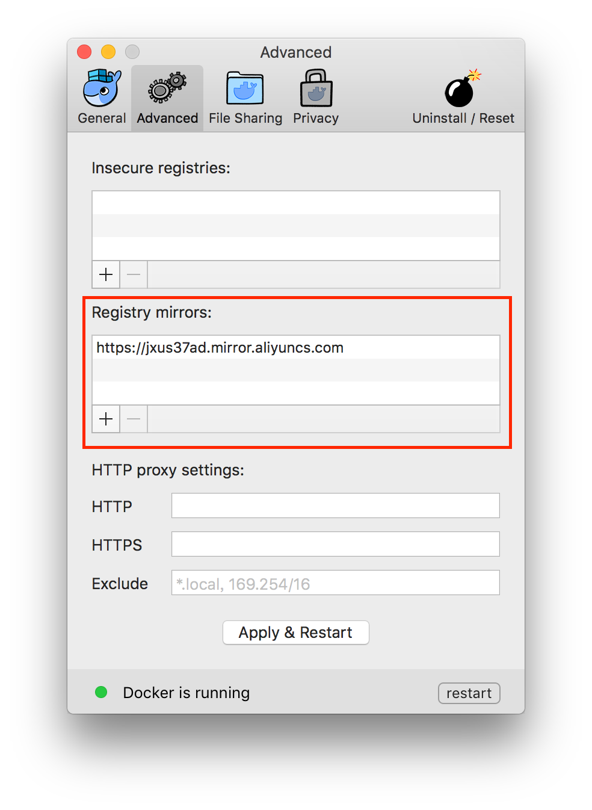

## macOS 作業系統安裝 Docker

### 系統要求

[Docker for Mac](https://docs.docker.com/docker-for-mac/) 要求系統最低為 macOS 10.10.3 Yosemite，或是 2010 年以後的 Mac 機型，準確說是帶 [Intel MMU 虛擬化](https://en.wikipedia.org/wiki/X86_virtualization#Intel-VT-d)的，最低 4GB  記憶體。如果系統不滿足需求，可以考慮安裝 [Docker Toolbox](https://docs.docker.com/toolbox/overview/)。如果機器安裝了 [VirtualBox](https://www.virtualbox.org/) 的話，VirtualBox 的版本不要低於 4.3.30。

### 安裝

#### 使用 Homebrew 安裝

[Homebrew](http://brew.sh/) 的 [Cask](https://caskroom.github.io/) 已經支援 Docker for Mac，因此可以很方便的使用 Homebrew Cask 來進行安裝：

```bash
brew cask install docker
```

#### 手動下載安裝

如果需要手動下載，可以透過這個連結下載：<https://download.docker.com/mac/stable/Docker.dmg>

如同 macOS 其它軟體一樣，安裝也非常簡單，按二下下載的 `.dmg` 檔案，然後將那只叫 [Moby](https://blog.docker.com/2013/10/call-me-moby-dock/) 的鯨魚 圖示拖拽到 `Application` 資料夾即可（其間可能會詢問系統密碼）。


### 執行

從應用中找到 Docker  圖示並點選執行。


執行之後，會在右上角功能表列看到多了一個鯨魚 圖示，這個 圖示表明了 Docker 的執行狀態。


第一次點選 圖示，可能會看到這個安裝成功的界面，點選 "Got it!" 可以關閉這個視窗。


以後每次點選鯨魚 圖示會跳出作業選單。


*在國內使用 Docker 的話，需要設定加速器，在選單中點選 `Preferences...`，然後 檢視 `Advanced` 標籤，在其中的 `Registry mirrors` 部分裡可以點選加號來加入加速器位址。*



啟動終端機後，透過指令可以檢查安裝後的 Docker 版本。

```bash
$ docker --version
Docker version 1.12.3, build 6b644ec
$ docker-compose --version
docker-compose version 1.8.1, build 878cff1
$ docker-machine --version
docker-machine version 0.8.2, build e18a919
```

如果 `docker version`、`docker info` 都正常的話，可以執行一個 [Nginx 伺服器](https://hub.docker.com/_/nginx/)：

```bash
$ docker run -d -p 80:80 --name webserver nginx
```

服務執行後，可以存取 <http://localhost>，如果看到了 "Welcome to nginx!"，就說明 Docker for Mac 安裝成功了。


要停止 Nginx 伺服器並刪除執行下面的指令：

```bash
$ docker stop webserver
$ docker rm webserver
```
